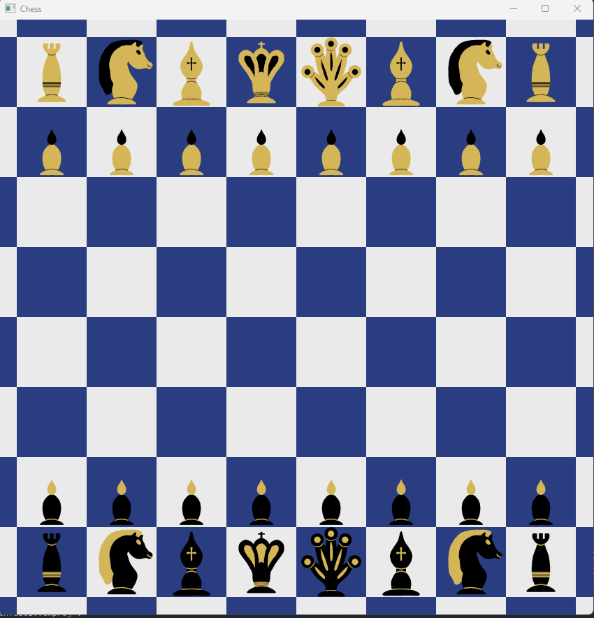
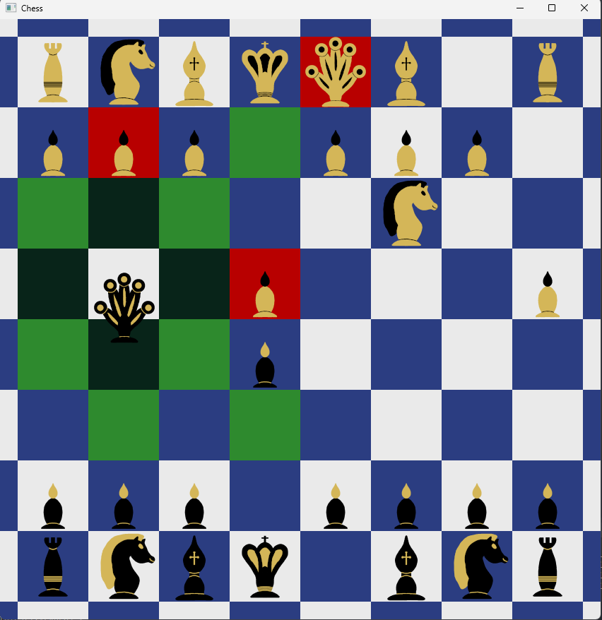

# Chess Game

### Technology
Project was made using SDL2 library and written in C++ language.

### Description
Basic chess game. Two players play against each other.
Game has turn-based system of moves.
The first player who check mate the adversary king wins.

View of board:

 

 Pieces can move and attack:

 
